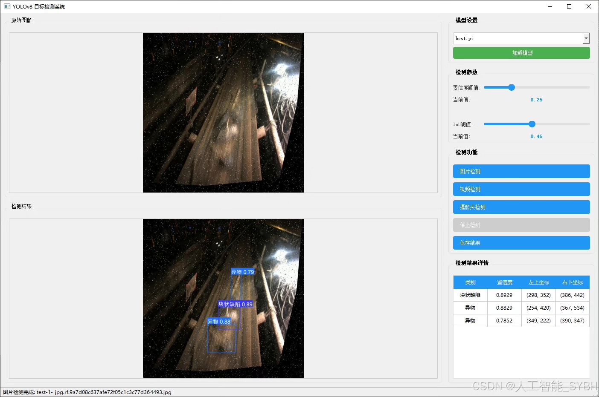
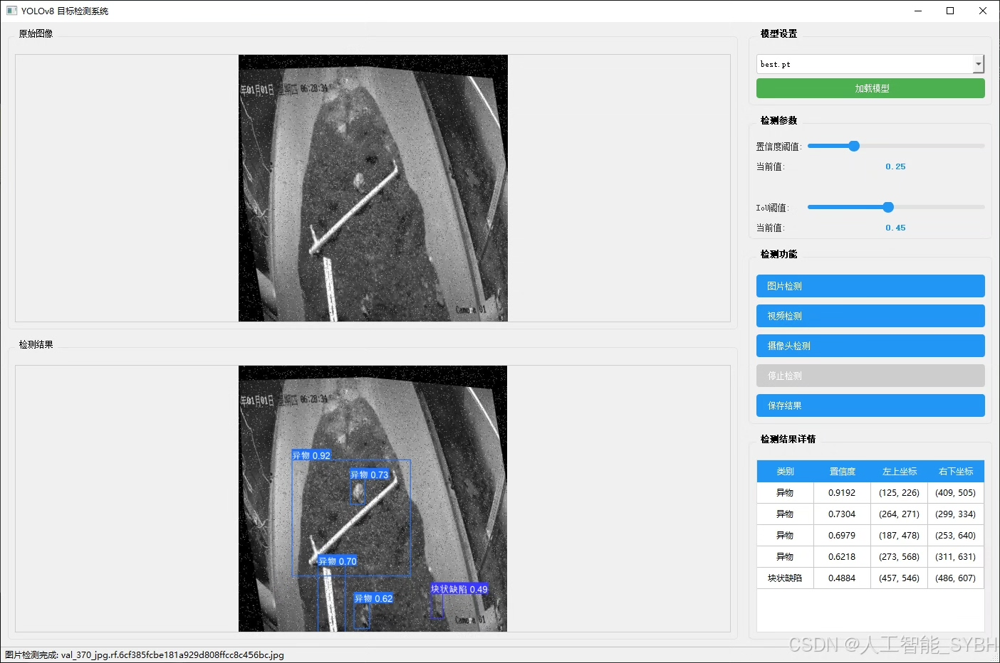
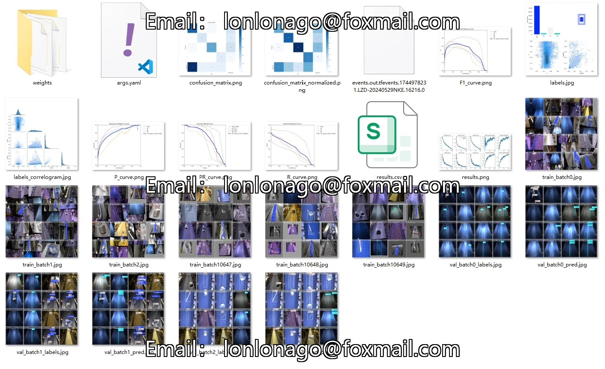
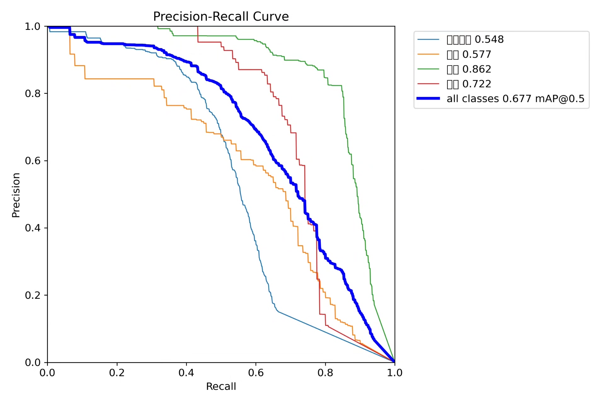
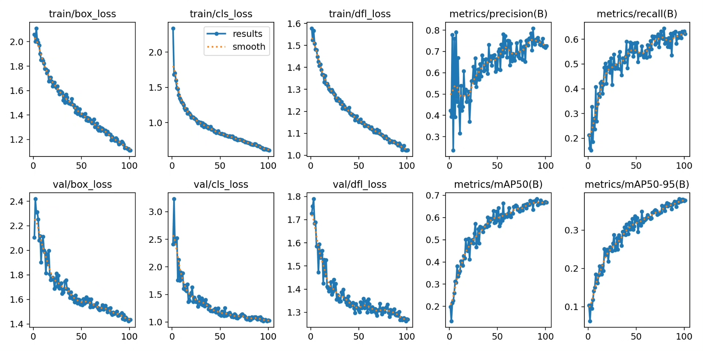
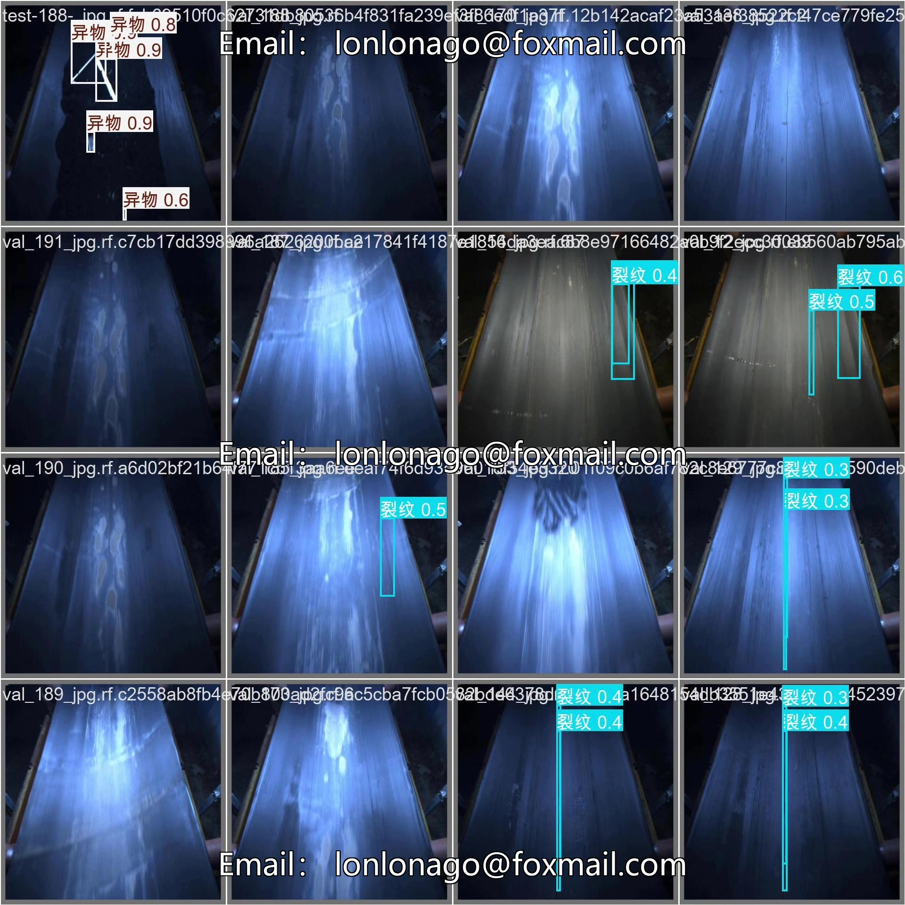
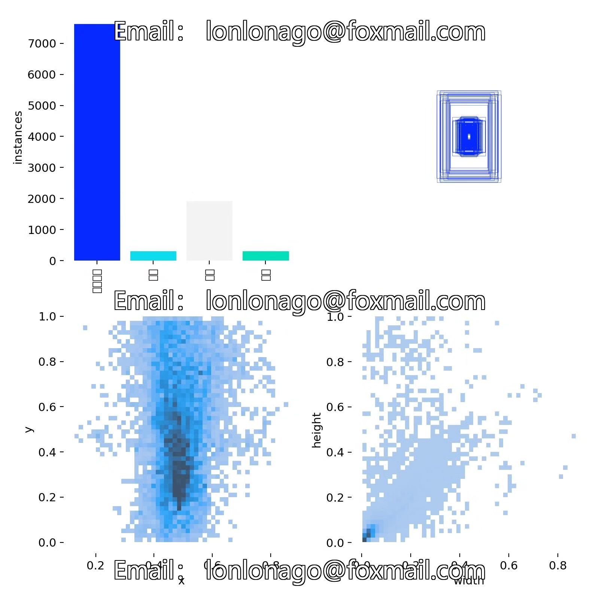
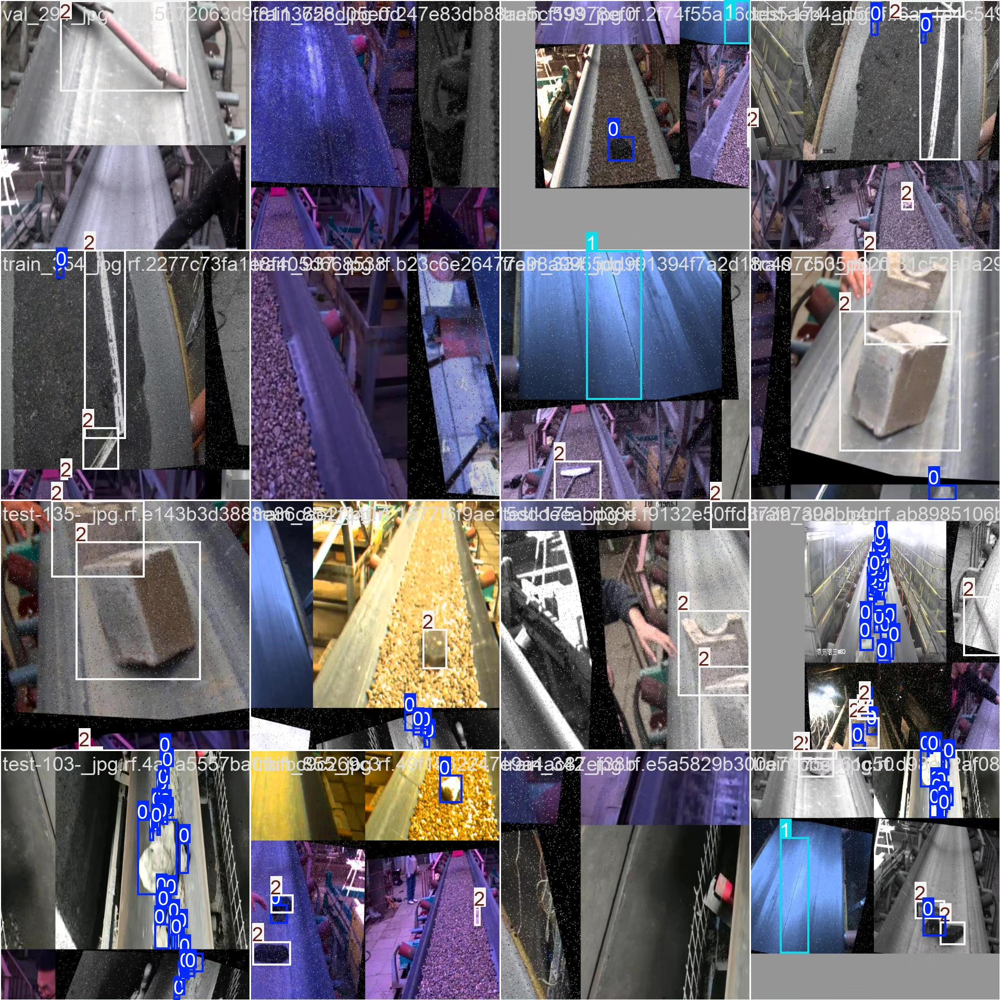

# Based on YOLOv8 deep learning, a conveyor belt defect detection system (YOLOv8+)

## Body

This project has developed a highly efficient and accurate intelligent detection system for conveyor belt defects based on the YOLOv8 deep learning algorithm. It can identify and classify four common types of defects on the surface of conveyor belts in real-time: blockage, crack, foreign object, and hole. The system uses professional datasets collected from industrial sites for training and validation, including 1860 training images, 318 validation images, and 167 test images, ensuring the model's applicability and reliability in real industrial environments.

The company's products have been granted the official commercial license certification by YOLO.

We provide after-sales service.

After payment, we will provide WeChat IDs to answer questions anytime.

Environmental configuration: We will provide an environmental configuration tutorial, and WeChat will provide answers.

Remote installation services: If you need remote configuration, an additional fee of 69 is required.
If the configuration fails, all fees will be refunded (specially for old computers only refund installation fees).

Retraining dataset: After setting up the environment, you can train on your own computer.
If you need us to retrain, just pay 69 plus computing power fees (2.5 yuan/hour).

Full after-sales service

## Images

## Payment

Here is a pay link on Stripe ( https://buy.stripe.com/3cs8yP7sY87d0vu9AB ). Please contact me lonlonago@foxmail.com after funding $89, and I will send you a complete data files , thank you!

